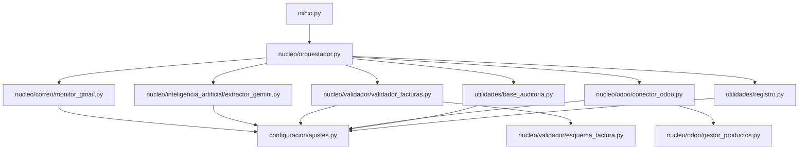

# Automatización de Facturas


> **Pipeline automatizado: Gmail → Gemini AI → Odoo**
> Lee facturas PDF recibidas por correo electrónico, extrae sus datos con inteligencia artificial y crea pedidos de compra en Odoo de forma completamente automática.

---

## Índice

1. [Inicio rápido](#1-inicio-rápido)
2. [Descripción general](#2-descripción-general)
3. [Objetivo del proyecto](#3-objetivo-del-proyecto)
4. [Tecnologías utilizadas](#4-tecnologías-utilizadas)
5. [Estructura del proyecto](#5-estructura-del-proyecto)
6. [Instalación y configuración](#6-instalación-y-configuración)
   - [6.1 Requisitos previos](#61-requisitos-previos)
   - [6.2 Instalación de dependencias](#62-instalación-de-dependencias)
   - [6.3 Configuración de Gmail (OAuth 2.0)](#63-configuración-de-gmail-oauth-20)
   - [6.4 Configuración de Gemini AI](#64-configuración-de-gemini-ai)
   - [6.5 Configuración de Odoo](#65-configuración-de-odoo)
   - [6.6 Variables de entorno (.env)](#66-variables-de-entorno-env)
7. [Uso](#7-uso)
8. [Diagramas de flujo](#8-diagramas-de-flujo)
9. [Flujo técnico detallado](#9-flujo-técnico-detallado)
10. [Módulos del proyecto](#10-módulos-del-proyecto)
11. [Base de datos de auditoría](#11-base-de-datos-de-auditoría)
12. [Política de reintentos y manejo de errores](#12-política-de-reintentos-y-manejo-de-errores)
13. [Despliegue en producción](#13-despliegue-en-producción)
14. [Pruebas](#14-pruebas)
15. [Seguridad](#15-seguridad)
16. [Limitaciones conocidas](#16-limitaciones-conocidas)
17. [Resolución de problemas](#17-resolución-de-problemas)
18. [Preguntas frecuentes](#18-preguntas-frecuentes)
19. [Contribución](#19-contribución)
20. [Changelog](#20-changelog)
21. [Glosario](#21-glosario)
22. [Licencia](#22-licencia)

---

## 1. Inicio rápido

Para tener el sistema funcionando desde cero en 5 pasos:

```bash
# 1. Instalar dependencias
python -m venv .venv && source .venv/bin/activate
pip install -r dependencias.txt

# 2. Configurar credenciales
cp .env.ejemplo .env
# → Editar .env con CLAVE_API_GEMINI, URL_ODOO, USUARIO_ODOO, CONTRASENA_ODOO

# 3. Colocar credenciales Gmail OAuth
# → Descargar credenciales.json de Google Cloud y guardarlo en configuracion/

# 4. Verificar que todo está conectado
python inicio.py --verificar-config

# 5. Arrancar el monitor
python inicio.py
```

> ¿Primera vez? Lee primero la sección [6.3 Configuración de Gmail](#63-configuración-de-gmail-oauth-20) para obtener el archivo `credenciales.json` y la sección [6.4](#64-configuración-de-gemini-ai) para obtener la clave de Gemini.

---

## 2. Descripción general

**Automatización de Facturas** es un sistema que monitoriza continuamente una cuenta de Gmail, detecta correos con facturas PDF adjuntas, extrae sus campos mediante la API multimodal de Gemini y crea automáticamente pedidos de compra en Odoo.

```
Gmail (facturas@empresa.es)
    │  correo con PDF adjunto
    ▼
MonitorGmail             ← nucleo/correo/monitor_gmail.py
    │  bytes del PDF
    ▼
ExtractorGemini          ← nucleo/inteligencia_artificial/extractor_gemini.py
    │  dict con campos extraídos
    ▼
ValidadorFacturas        ← nucleo/validador/validador_facturas.py
    │  objeto Factura validado
    ▼
ConectorOdoo             ← nucleo/odoo/conector_odoo.py
    │  purchase.order creado
    ▼
BaseAuditoria + Registro ← utilidades/base_auditoria.py, utilidades/registro.py
```

---

## 3. Objetivo del proyecto

Eliminar el procesamiento manual de facturas de proveedores, automatizando la cadena completa desde la recepción del correo hasta el registro contable en Odoo. Esto reduce errores humanos, acelera el ciclo de compras y mantiene un registro de auditoría completo de cada factura procesada.

---

## 4. Tecnologías utilizadas

| Categoría | Tecnología | Versión mínima |
|---|---|---|
| Lenguaje | Python | 3.11 |
| Gmail API | google-api-python-client | 2.131.0 |
| Autenticación Google | google-auth-oauthlib | 1.2.0 |
| IA — Extracción | google-genai (Gemini) | 1.0.0 |
| Procesamiento PDF | pymupdf, pypdf | 1.25.0 / 4.0.0 |
| Validación de datos | pydantic, pydantic-settings | 2.10.0 / 2.7.0 |
| Variables de entorno | python-dotenv | 1.0.1 |
| Cola de tareas | celery + redis | 5.3.6 / 5.0.4 |
| Logging | loguru | 0.7.2 |
| Reintentos automáticos | tenacity | 8.3.0 |
| Fechas | python-dateutil | 2.9.0 |
| ERP destino | Odoo (XML-RPC) | 14, 15, 16 o 17 |
| Auditoría | SQLite (stdlib) | — |
| Pruebas | pytest, pytest-mock | 8.2.0 / 3.14.0 |

---

## 5. Estructura del proyecto

```
automatizacion_facturas/
│
├── inicio.py                          ← Punto de entrada principal (CLI)
├── dependencias.txt                   ← Dependencias Python
├── ver_modelos.py                     ← Utilidad de inspección de modelos Pydantic
├── .env                               ← Variables de entorno (NO subir a git)
├── .gitignore
│
├── configuracion/
│   ├── ajustes.py                     ← Configuración centralizada (pydantic-settings)
│   ├── credenciales.json              ← OAuth Gmail — NO subir a git
│   └── token.json                     ← Token OAuth generado — NO subir a git
│
├── nucleo/
│   ├── orquestador.py                 ← Pipeline principal que conecta todos los módulos
│   │
│   ├── correo/
│   │   └── monitor_gmail.py           ← Lectura de correos y extracción de PDFs adjuntos
│   │
│   ├── inteligencia_artificial/
│   │   └── extractor_gemini.py        ← Extracción de campos con Gemini API (multimodal)
│   │
│   ├── validador/
│   │   ├── esquema_factura.py         ← Modelos Pydantic: Factura e ItemFactura
│   │   └── validador_facturas.py      ← Lógica de validación de campos y coherencia
│   │
│   └── odoo/
│       ├── conector_odoo.py           ← Integración con Odoo vía XML-RPC
│       └── gestor_productos.py        ← Búsqueda y creación de productos en Odoo
│
├── utilidades/
│   ├── registro.py                    ← Configuración de loguru (3 salidas)
│   └── base_auditoria.py              ← Base de datos SQLite de auditoría
│
├── pruebas/
│   ├── test_base_auditoria.py
│   ├── test_gestor_productos.py
│   └── test_validador_facturas.py
│
├── datos/
│   ├── auditoria.db                   ← Base de datos de auditoría (auto-generada)
│   └── ejemplos/
│       └── Factura Trixder JyS SL 3085.pdf  ← PDF de muestra para pruebas
│
├── registros/
│   ├── aplicacion.log                 ← Log general (todos los niveles, rotación 10 MB)
│   └── errores.log                    ← Solo errores con traceback completo
│
└── docs/
    └── README.md                      ← Documentación interna extendida
```

### Diagrama de dependencias entre módulos



> **Nota sobre `docs/`:** Contiene documentación técnica adicional y guías de desarrollo internas.

---

## 6. Instalación y configuración

### 6.1 Requisitos previos

- Python 3.11 o superior
- pip actualizado
- Acceso a internet (APIs de Google y Odoo)
- Una cuenta de Gmail con API habilitada
- Una instancia de Odoo accesible (local o en la nube)
- Una clave de API de Google Gemini

### 6.2 Instalación de dependencias

```bash
# 1. Clonar o descomprimir el proyecto
unzip automatizacion_facturas.zip
cd automatizacion_facturas

# 2. Crear y activar entorno virtual
python -m venv .venv

source .venv/bin/activate   # Linux / macOS
.venv\Scripts\activate      # Windows

# 3. Actualizar pip e instalar dependencias
pip install --upgrade pip
pip install -r dependencias.txt

# 4. Crear el archivo de configuración
cp .env.ejemplo .env
# Editar .env con tus credenciales (ver secciones 6.3 a 6.5)
```

### 6.3 Configuración de Gmail (OAuth 2.0)

El sistema usa la **Gmail API** con OAuth 2.0, lo que permite acceso seguro sin exponer contraseñas.

**Paso 1 — Crear proyecto en Google Cloud Console**

1. Ir a [console.cloud.google.com](https://console.cloud.google.com)
2. **Nuevo proyecto** → nombre: `automatizacion-facturas`
3. Ir a **APIs y servicios** → **Biblioteca** → buscar **Gmail API** → **Habilitar**

**Paso 2 — Crear credenciales OAuth 2.0**

1. **APIs y servicios** → **Credenciales** → **+ Crear credenciales** → **ID de cliente de OAuth**
2. Configurar la pantalla de consentimiento (tipo: Externo) si se solicita
3. Tipo de aplicación: **Aplicación de escritorio**
4. Descargar el JSON y guardarlo como `configuracion/credenciales.json`

**Paso 3 — Añadir usuario de prueba** (si la app está en modo "Testing")

1. **APIs y servicios** → **Pantalla de consentimiento** → **Usuarios de prueba** → añadir el correo a monitorizar

**Paso 4 — Primera autorización**

```bash
python inicio.py --verificar-config
```

Se abrirá el navegador automáticamente. Tras autorizar, se crea `configuracion/token.json`. Las siguientes ejecuciones no requieren este paso; el token se renueva de forma automática.

### 6.4 Configuración de Gemini AI

1. Ir a [aistudio.google.com](https://aistudio.google.com)
2. **Get API key** → **Create API key** → seleccionar el proyecto de Google Cloud
3. Copiar la clave (empieza por `AIza...`)

> **Modelos disponibles:**
> - `gemini-1.5-pro` — Mayor precisión; recomendado para facturas complejas
> - `gemini-1.5-flash` — Más rápido, límite gratuito de 1 500 req/día (recomendado para producción)

### 6.5 Configuración de Odoo

**Requisitos en Odoo:**
- Versión 14, 15, 16 o 17
- Módulo **Purchase** instalado
- Usuario con los siguientes permisos mínimos (perfil recomendado: **Usuario de Compras**):

| Objeto Odoo | Permiso necesario |
|---|---|
| `res.partner` | Leer, Crear |
| `purchase.order` | Leer, Crear |
| `purchase.order.line` | Leer, Crear |
| `product.product` | Leer, Crear |
| `product.template` | Leer, Crear |

> No se necesitan permisos de administrador. Se recomienda crear un usuario específico para la integración (`apibot@empresa.es`) y no usar el administrador de Odoo.

### 6.6 Variables de entorno (.env)

Copia `.env.ejemplo` como `.env` y rellena los valores. A continuación se describen todas las variables disponibles:

#### Gmail

| Variable | Obligatoria | Valor por defecto | Descripción |
|---|---|---|---|
| `RUTA_CREDENCIALES_GMAIL` | Sí | `configuracion/credenciales.json` | Ruta al JSON de credenciales OAuth descargado de Google Cloud |
| `RUTA_TOKEN_GMAIL` | Sí | `configuracion/token.json` | Ruta donde se almacena el token OAuth generado tras la primera autorización |
| `CORREO_MONITORIZADO` | Sí | `facturas@empresa.es` | Dirección de Gmail a monitorizar |
| `ETIQUETA_GMAIL` | No | `INBOX` | Carpeta o etiqueta de Gmail donde buscar correos (`INBOX`, `facturas`, etc.) |
| `INTERVALO_SONDEO_SEGUNDOS` | No | `60` | Segundos entre cada consulta a Gmail. Mínimo: 10. Recomendado en producción: 60–300 |

#### Gemini AI

| Variable | Obligatoria | Valor por defecto | Descripción |
|---|---|---|---|
| `CLAVE_API_GEMINI` | Sí | — | Clave de API de Google Gemini (empieza por `AIza...`) |
| `MODELO_GEMINI` | No | `gemini-1.5-pro` | Modelo a usar. Opciones: `gemini-1.5-pro`, `gemini-1.5-flash` |
| `TEMPERATURA_GEMINI` | No | `0.0` | Temperatura de generación. Mantener en `0.0` para máxima consistencia en extracción de datos |

#### Odoo

| Variable | Obligatoria | Valor por defecto | Descripción |
|---|---|---|---|
| `URL_ODOO` | Sí | `http://localhost:8069` | URL completa de la instancia Odoo (con protocolo y puerto si no es el estándar) |
| `BASE_DATOS_ODOO` | Sí | `odoo` | Nombre de la base de datos en Odoo |
| `USUARIO_ODOO` | Sí | `admin` | Correo del usuario de Odoo con permisos de compras |
| `CONTRASENA_ODOO` | Sí | — | Contraseña del usuario de Odoo |

#### Aplicación

| Variable | Obligatoria | Valor por defecto | Descripción |
|---|---|---|---|
| `NIVEL_REGISTRO` | No | `INFO` | Nivel de log. Opciones: `DEBUG`, `INFO`, `WARNING`, `ERROR` |
| `DIRECTORIO_REGISTROS` | No | `registros` | Carpeta donde se guardan los archivos de log |
| `DIRECTORIO_DATOS` | No | `datos` | Carpeta para la base de datos de auditoría y PDFs temporales |
| `MAX_REINTENTOS` | No | `3` | Número máximo de reintentos ante fallos de Gemini o Odoo |
| `PAUSA_REINTENTO_SEGUNDOS` | No | `60` | Segundos base de espera entre reintentos (se aplica espera exponencial) |

**Ejemplo completo de `.env`:**

```ini
# Gmail
RUTA_CREDENCIALES_GMAIL=configuracion/credenciales.json
RUTA_TOKEN_GMAIL=configuracion/token.json
CORREO_MONITORIZADO=facturas@empresa.es
ETIQUETA_GMAIL=INBOX
INTERVALO_SONDEO_SEGUNDOS=60

# Gemini AI
CLAVE_API_GEMINI=AIzaSyABC123...tu_clave_real
MODELO_GEMINI=gemini-1.5-pro
TEMPERATURA_GEMINI=0.0

# Odoo
URL_ODOO=https://tuempresa.odoo.com
BASE_DATOS_ODOO=produccion
USUARIO_ODOO=apibot@empresa.es
CONTRASENA_ODOO=MiContraseñaSegura123

# Aplicación
NIVEL_REGISTRO=INFO
DIRECTORIO_REGISTROS=registros
DIRECTORIO_DATOS=datos
MAX_REINTENTOS=3
PAUSA_REINTENTO_SEGUNDOS=60
```

> ⚠️ El archivo `.env` está incluido en `.gitignore`. **Nunca lo subas a un repositorio.**

---

## 7. Uso

### Verificar configuración (ejecutar siempre primero)

```bash
python inicio.py --verificar-config
```

Salida esperada:

```
2026-03-19 09:55:01 | INFO    | ✓ Archivo .env encontrado
2026-03-19 09:55:01 | INFO    | ✓ credenciales.json encontrado
2026-03-19 09:55:02 | INFO    | ✓ CLAVE_API_GEMINI configurada (gemini-1.5-pro)
2026-03-19 09:55:03 | INFO    | ✓ Conexión Odoo exitosa: v17.0
2026-03-19 09:55:03 | INFO    | ✓ Configuración correcta. Listo para ejecutar.
```

### Procesar un PDF local (modo prueba)

Ideal para verificar que Gemini y Odoo funcionan antes de activar el monitor de Gmail:

```bash
# Procesamiento completo con integración Odoo
python inicio.py --archivo datos/ejemplos/factura.pdf

# Solo extracción y validación (sin crear nada en Odoo)
python inicio.py --archivo datos/ejemplos/factura.pdf --sin-odoo
```

Salida de ejemplo con `--sin-odoo`:

```
2026-03-19 10:12:44 | INFO    | Procesando: factura.pdf
2026-03-19 10:12:46 | SUCCESS | ✓ Extracción Gemini completada
2026-03-19 10:12:46 | INFO    |   Proveedor : Trixder JyS SL
2026-03-19 10:12:46 | INFO    |   CIF       : B12345678
2026-03-19 10:12:46 | INFO    |   Nº factura: 3085
2026-03-19 10:12:46 | INFO    |   Total     : 1.210,00 €
2026-03-19 10:12:46 | SUCCESS | ✓ Validación Pydantic correcta
2026-03-19 10:12:46 | WARNING | Modo --sin-odoo activo. No se creará pedido.
```

### Monitor continuo (modo producción)

```bash
python inicio.py
```

El programa se ejecuta indefinidamente y:
1. Revisa Gmail cada N segundos (según `INTERVALO_SONDEO_SEGUNDOS`)
2. Descarga los PDFs adjuntos de los correos no leídos
3. Extrae campos con Gemini, los valida y crea el pedido en Odoo
4. Marca el correo como leído si el proceso fue exitoso
5. Registra todo en `registros/aplicacion.log`

### Ver estadísticas de procesamiento

```bash
python inicio.py --estadisticas
```

```
=== Estadísticas de procesamiento ===
  procesada   :   35  (87.5%)
  fallida     :    1  ( 2.5%)
  invalida    :    2  ( 5.0%)
  duplicada   :    2  ( 5.0%)
  TOTAL       :   40
```

### Ver facturas con errores

```bash
python inicio.py --fallidas
```

---

## 8. Diagramas de flujo

El sistema opera en dos fases encadenadas. La Fase 1 cubre desde la detección del correo hasta la extracción con Gemini; la Fase 2 cubre la validación, la escritura en Odoo y el cierre del ciclo de auditoría.

### Fase 1 — Gmail → Gemini

```
┌──────────────────────────────────────────────────────────────────┐
│                      INICIO DEL SISTEMA                          │
└───────────────────────────┬──────────────────────────────────────┘
                            │
                            ▼
               ┌────────────────────────┐
               │      MonitorGmail      │  bucle: busca correos
               │   no leídos con PDF    │  (is:unread has:attachment filename:pdf)
               └────────────┬───────────┘
                            │
                            ▼
               ┌────────────────────────┐      No
               │  ¿Hay correos nuevos   │ ──────────► espera N segundos ──► vuelve al bucle
               │      con PDF?          │
               └────────────┬───────────┘
                            │ Sí
                            ▼
               ┌────────────────────────┐
               │  Descargar PDF adjunto │  extrae bytes del adjunto MIME
               └────────────┬───────────┘
                            │
                            ▼
               ┌────────────────────────┐
               │     BaseAuditoria      │  calcula hash SHA-256 del PDF
               └────────────┬───────────┘
                            │
                            ▼
               ┌────────────────────────┐      Sí
               │  ¿Hash ya existe como  │ ──────────► estado: DUPLICADA  (omite el correo)
               │      procesada?        │
               └────────────┬───────────┘
                            │ No
                            ▼
               ┌────────────────────────┐
               │    ExtractorGemini     │  envía PDF en base64 a Gemini API
               └────────────┬───────────┘
                            │
                            ▼
               ┌────────────────────────┐      No     ┌──────────────────────┐
               │  ¿API responde con     │ ──────────► │       Reintento      │
               │    JSON válido?        │             │  espera 10 / 20 / 40s│
               └────────────┬───────────┘             └──────────┬───────────┘
                            │ Sí                                 │ (hasta 3 intentos)
                            │◄───────────────────────────────────┘
                            ▼
               ┌────────────────────────┐
               │  JSON extraído listo   │  continúa en Fase 2 ↓
               └────────────────────────┘
```

### Fase 2 — Validación → Odoo → Auditoría

```
               ┌────────────────────────┐
               │   JSON de Gemini       │  ← continúa desde Fase 1
               └────────────┬───────────┘
                            │
                            ▼
               ┌────────────────────────┐
               │  ValidadorFacturas     │  valida: campos obligatorios, CIF,
               │     (Pydantic)         │  fechas, coherencia de importes
               └────────────┬───────────┘
                            │
                            ▼
               ┌────────────────────────┐      No
               │  ¿Supera validación    │ ──────────► estado: INVÁLIDA  (registra error)
               │      Pydantic?         │
               └────────────┬───────────┘
                            │ Sí
                            ▼
               ┌────────────────────────┐
               │  ConectorOdoo          │  busca res.partner por CIF
               │  — Proveedor           │
               └────────────┬───────────┘
                            │
                            ▼
               ┌────────────────────────┐      No     ┌──────────────────────┐
               │  ¿Proveedor existe     │ ──────────► │  Crear res.partner   │
               │     en Odoo?           │             │  (nombre + CIF)      │
               └────────────┬───────────┘             └──────────┬───────────┘
                            │ Sí                                 │
                            │◄───────────────────────────────────┘
                            ▼
               ┌────────────────────────┐      Sí
               │  ¿Pedido con nº        │ ──────────► estado: DUPLICADA  (idempotencia)
               │  factura ya existe?    │
               └────────────┬───────────┘
                            │ No
                            ▼
               ┌────────────────────────┐
               │    GestorProductos     │  busca o crea product.product
               │                        │  por cada línea de factura
               └────────────┬───────────┘
                            │
                            ▼
               ┌────────────────────────┐
               │  ConectorOdoo          │  crea purchase.order con líneas
               │  — Crear pedido        │
               └────────────┬───────────┘
                            │
                            ▼
               ┌────────────────────────┐      No
               │  ¿Pedido creado        │ ──────────► estado: FALLIDA  (registra traceback)
               │     con éxito?         │
               └────────────┬───────────┘
                            │ Sí
                            ▼
               ┌────────────────────────┐
               │  BaseAuditoria         │  estado: PROCESADA
               │  + Registro            │  marca correo como leído en Gmail
               └────────────┬───────────┘
                            │
                            ▼
               ┌────────────────────────┐
               │    Ciclo completado    │  vuelve al bucle (Fase 1)
               └────────────────────────┘
```

**Código de estados:**

| Estado | Descripción |
|---|---|
| `PROCESADA` | Factura extraída, validada y pedido creado en Odoo correctamente |
| `DUPLICADA` | El hash SHA-256 del PDF o el número de factura ya existían en la base de datos |
| `INVÁLIDA` | Los datos extraídos no superan la validación Pydantic |
| `FALLIDA` | Error técnico durante extracción, conexión o escritura en Odoo |

---

## 9. Flujo técnico detallado

**1. Detección de correos** — `MonitorGmail` ejecuta la búsqueda `is:unread has:attachment filename:pdf`, extrae los metadatos del correo y descarga el binario del PDF.

**2. Verificación de duplicados** — Antes de llamar a Gemini, se calcula el hash SHA-256 del PDF y se consulta la base de datos de auditoría. Si el hash ya existe con estado `procesada`, el correo se omite sin consumir cuota de API.

**3. Extracción con Gemini** — El PDF se codifica en base64 y se envía a Gemini como documento multimodal junto con el prompt de extracción few-shot. Gemini devuelve un JSON estructurado con los campos de la factura. Si la API falla, se reintenta automáticamente hasta 3 veces con espera exponencial (10 s, 20 s, 40 s).

**4. Validación con Pydantic** — El JSON se valida contra el modelo `Factura`:
- Campos obligatorios presentes y no vacíos
- CIF/NIF/NIE con formato válido (regex)
- Fechas en múltiples formatos (`YYYY-MM-DD`, `DD/MM/YYYY`, `DD-MM-YYYY`)
- Coherencia de importes: `base_imponible + IVA ≈ total` (tolerancia ±0,10 €)
- Al menos una línea de detalle presente
- Importes positivos

**5. Creación en Odoo** — `ConectorOdoo` busca o crea el proveedor por CIF en `res.partner`, verifica que el pedido no exista ya (idempotencia por número de factura) y crea el `purchase.order` con sus líneas de producto.

**6. Auditoría y marcado** — Se actualiza el registro en `datos/auditoria.db` con el estado final. Si fue exitoso, el correo se marca como leído en Gmail y el ciclo vuelve al inicio.

---

## 10. Módulos del proyecto

### `configuracion/ajustes.py`

Configuración centralizada con `pydantic-settings`. Lee el archivo `.env` automáticamente y valida los tipos de cada variable. Se importa como instancia global `ajustes` en el resto del proyecto.

Métodos públicos relevantes: `obtener_directorio_datos() → Path`, `obtener_directorio_registros() → Path`.

### `utilidades/registro.py`

Configura `loguru` con tres salidas simultáneas: consola con color, `registros/aplicacion.log` (todos los niveles, rotación 10 MB) y `registros/errores.log` (solo errores con traceback completo). Exporta la instancia global `registro` lista para usar con `registro.info(...)`, `registro.error(...)`, etc.

### `utilidades/base_auditoria.py`

Base de datos SQLite con tabla `auditoria_facturas`. Ver sección [11. Base de datos de auditoría](#11-base-de-datos-de-auditoría) para el esquema completo.

Métodos públicos relevantes: `registrar(email_id, hash_pdf, nombre_archivo) → int`, `actualizar_estado(id, estado, **kwargs)`, `existe_hash(hash_pdf) → bool`, `obtener_estadisticas() → dict`, `listar_fallidas() → list`.

### `nucleo/correo/monitor_gmail.py`

Clase `MonitorGmail` con autenticación OAuth2 automática.

Métodos públicos relevantes: `obtener_nuevas_facturas() → list[AdjuntoEmail]`, `marcar_como_leido(msg_id: str)`, `ejecutar_continuo(callback: Callable)`.

### `nucleo/inteligencia_artificial/extractor_gemini.py`

Clase `ExtractorGemini`. Envía el PDF como documento multimodal a Gemini junto con el prompt de extracción few-shot. Incluye reintentos automáticos con `tenacity`.

Métodos públicos relevantes: `extraer(pdf_bytes: bytes) → dict`, `verificar_conexion() → bool`.

### `nucleo/validador/esquema_factura.py`

Modelos Pydantic `Factura` e `ItemFactura` con validadores de campo: formato CIF (`validar_cif`), parseo de fechas en múltiples formatos (`parsear_fecha`), coherencia de importes (`validar_coherencia_importes`) y presencia de al menos una línea de detalle.

### `nucleo/validador/validador_facturas.py`

Clase `ValidadorFacturas`. Recibe el dict de Gemini y devuelve un objeto `Factura` validado o lanza `ValidationError` con el detalle del fallo.

Métodos públicos relevantes: `validar(datos: dict) → Factura`.

### `nucleo/odoo/conector_odoo.py`

Clase `ConectorOdoo` con conexión XML-RPC a Odoo. Gestiona búsqueda/creación de proveedor, comprobación de idempotencia y creación del `purchase.order`.

Métodos públicos relevantes: `obtener_o_crear_proveedor(factura: Factura) → int`, `factura_ya_existe(numero: str, partner_id: int) → int | None`, `crear_pedido_compra(factura: Factura) → int`, `verificar_conexion() → str`.

### `nucleo/odoo/gestor_productos.py`

Clase `GestorProductos`. Busca productos existentes en Odoo por descripción y los crea si no existen, evitando duplicados en el catálogo.

Métodos públicos relevantes: `obtener_o_crear_producto(descripcion: str) → int`.

### `nucleo/orquestador.py`

Clase `OrquestadorFacturas`. Conecta todos los módulos anteriores en el pipeline completo.

Métodos públicos relevantes: `procesar_archivo_pdf(ruta: Path) → dict`, `procesar_bytes(pdf_bytes: bytes, email_id: str, nombre: str) → dict`, `ejecutar()` (bucle continuo).

---

## 11. Base de datos de auditoría

El archivo `datos/auditoria.db` es una base de datos SQLite generada automáticamente al arrancar la aplicación. Contiene una única tabla: `auditoria_facturas`.

### Esquema de la tabla

| Columna | Tipo | Descripción |
|---|---|---|
| `id` | INTEGER PK | Identificador autoincremental |
| `email_id` | TEXT | ID del mensaje en Gmail |
| `hash_pdf` | TEXT UNIQUE | Hash SHA-256 del PDF (usado para detección de duplicados) |
| `nombre_archivo` | TEXT | Nombre del archivo PDF adjunto |
| `estado` | TEXT | Estado del procesamiento (ver valores más abajo) |
| `numero_factura` | TEXT | Número de factura extraído por Gemini |
| `proveedor` | TEXT | Nombre del proveedor extraído |
| `total` | REAL | Importe total de la factura |
| `id_pedido_odoo` | INTEGER | ID del `purchase.order` creado en Odoo (`NULL` si no se llegó a crear) |
| `error` | TEXT | Mensaje de error detallado (`NULL` si fue exitoso) |
| `fecha_creacion` | TEXT | Timestamp ISO 8601 de cuando se registró el intento |
| `fecha_actualizacion` | TEXT | Timestamp ISO 8601 de la última actualización de estado |

### Valores posibles del campo `estado`

| Valor | Descripción |
|---|---|
| `pendiente` | Descargado pero aún no procesado |
| `procesando` | En curso (útil para detectar procesos interrumpidos) |
| `procesada` | Completado con éxito; pedido Odoo creado |
| `fallida` | Error técnico durante el procesamiento |
| `invalida` | Los datos extraídos no superaron la validación Pydantic |
| `duplicada` | Hash SHA-256 o número de factura ya existían en la base de datos |

### Consultas útiles

```bash
# Ver todas las facturas fallidas o inválidas
sqlite3 datos/auditoria.db \
  "SELECT fecha_creacion, proveedor, estado, error FROM auditoria_facturas
   WHERE estado IN ('fallida', 'invalida') ORDER BY fecha_creacion DESC;"

# Ver resumen de estados
sqlite3 datos/auditoria.db \
  "SELECT estado, COUNT(*) as total FROM auditoria_facturas GROUP BY estado;"

# Buscar una factura concreta por número
sqlite3 datos/auditoria.db \
  "SELECT * FROM auditoria_facturas WHERE numero_factura = '3085';"

# Detectar procesos interrumpidos
sqlite3 datos/auditoria.db \
  "SELECT * FROM auditoria_facturas WHERE estado = 'procesando';"
```

---

## 12. Política de reintentos y manejo de errores

### Reintentos automáticos (Gemini)

Cuando la API de Gemini devuelve un error (rate limit, timeout o JSON malformado), el sistema reintenta automáticamente con espera exponencial gestionada por `tenacity`:

| Intento | Espera antes del reintento |
|---|---|
| 1º | 10 segundos |
| 2º | 20 segundos |
| 3º | 40 segundos |
| 4º (sin más reintentos) | La factura pasa a estado `fallida` |

### Qué ocurre al agotar los reintentos

Si se agotan los 3 reintentos sin éxito, el sistema:
1. Registra el error completo (tipo de excepción y traceback) en la columna `error` de `auditoria_facturas`
2. Marca la factura con estado `fallida` en la base de datos
3. Escribe el traceback completo en `registros/errores.log`
4. **No marca el correo como leído** en Gmail, por lo que será reintentado en el siguiente ciclo de monitorización

### Idempotencia ante reinicios

Si el proceso se interrumpe bruscamente con una factura en estado `procesando`, en el siguiente arranque esas facturas quedan visibles como potencialmente incompletas. Se puede consultar con:

```bash
sqlite3 datos/auditoria.db \
  "SELECT * FROM auditoria_facturas WHERE estado = 'procesando';"
```

### Estados de error y su recuperación

| Estado | ¿El correo queda sin leer? | Acción recomendada |
|---|---|---|
| `fallida` | Sí | Se reintentará automáticamente en el próximo ciclo |
| `invalida` | No | Revisar el PDF manualmente; puede ser un formato no reconocido por Gemini |
| `duplicada` | No | Comportamiento esperado; no requiere acción |

---

## 13. Despliegue en producción

### Opción A — Servicio systemd (Linux)

Crea el archivo `/etc/systemd/system/automatizacion-facturas.service`:

```ini
[Unit]
Description=Automatización de Facturas — Monitor Gmail
After=network.target

[Service]
Type=simple
User=ubuntu
WorkingDirectory=/opt/automatizacion_facturas
ExecStart=/opt/automatizacion_facturas/.venv/bin/python inicio.py
Restart=on-failure
RestartSec=30
EnvironmentFile=/opt/automatizacion_facturas/.env

[Install]
WantedBy=multi-user.target
```

```bash
# Habilitar e iniciar
sudo systemctl daemon-reload
sudo systemctl enable automatizacion-facturas
sudo systemctl start automatizacion-facturas

# Comprobar estado
sudo systemctl status automatizacion-facturas

# Ver logs en tiempo real
sudo journalctl -u automatizacion-facturas -f
```

> **Primera autorización OAuth en servidor sin GUI:** genera `configuracion/token.json` en tu máquina local ejecutando `python inicio.py --verificar-config` y cópialo al servidor antes de activar el servicio.

### Opción B — Docker Compose

```yaml
# docker-compose.yml
version: "3.9"

services:
  factura-bot:
    build: .
    restart: unless-stopped
    env_file: .env
    volumes:
      - ./configuracion:/app/configuracion
      - ./datos:/app/datos
      - ./registros:/app/registros
```

```dockerfile
# Dockerfile
FROM python:3.11-slim
WORKDIR /app
COPY dependencias.txt .
RUN pip install --no-cache-dir -r dependencias.txt
COPY . .
CMD ["python", "inicio.py"]
```

```bash
docker compose up -d
docker compose logs -f
```

### Ejecución en segundo plano (sin systemd ni Docker)

```bash
nohup python inicio.py > registros/stdout.log 2>&1 &
echo $! > app.pid

# Para detener
kill $(cat app.pid)
```

---

## 14. Pruebas

Los tests de Odoo y Gmail usan mocks completos y **no requieren conexión real** a ningún servicio externo. Se puede ejecutar la suite completa en cualquier máquina sin credenciales configuradas.

```bash
# Ejecutar todos los tests (no requiere Odoo ni Gmail reales)
pytest pruebas/ -v

# Solo tests del validador (sin ninguna dependencia externa)
pytest pruebas/test_validador_facturas.py -v

# Solo tests de Odoo con mocks
pytest pruebas/test_gestor_productos.py -v

# Con reporte de cobertura
pip install pytest-cov
pytest pruebas/ -v --cov=nucleo --cov=utilidades --cov-report=term-missing
```

Para ejecutar los tests es suficiente con tener el entorno virtual activo y las dependencias instaladas. No hace falta `.env` ni credenciales de ningún tipo.

| Archivo de prueba | Requiere servicios externos | Descripción |
|---|---|---|
| `test_validador_facturas.py` | No | Validación de CIFs, importes, fechas y coherencia de totales |
| `test_gestor_productos.py` | No (usa mocks) | Búsqueda y creación de productos en Odoo simulado |
| `test_base_auditoria.py` | No | Operaciones CRUD sobre SQLite en memoria |

---

## 15. Seguridad

### Archivos sensibles

Los siguientes archivos contienen credenciales y **nunca deben subirse a un repositorio de código**. Todos están incluidos en `.gitignore`:

| Archivo | Contenido | Qué hacer si se expone |
|---|---|---|
| `.env` | Claves de API y contraseñas de Odoo | Rotar `CLAVE_API_GEMINI` en AI Studio y cambiar contraseña de Odoo |
| `configuracion/credenciales.json` | Client ID y Client Secret OAuth de Google | Eliminar y recrear las credenciales OAuth en Google Cloud Console |
| `configuracion/token.json` | Token de acceso OAuth a Gmail | Revocar en [myaccount.google.com/permissions](https://myaccount.google.com/permissions) y regenerar |

### Permisos de archivo recomendados (Linux)

```bash
# Solo el usuario propietario puede leer los archivos de credenciales
chmod 600 .env
chmod 600 configuracion/credenciales.json
chmod 600 configuracion/token.json

# El directorio de configuración tampoco debe ser legible por otros
chmod 700 configuracion/
```

### Qué hacer si se compromete una credencial

**Token OAuth de Gmail comprometido:**
1. Ir a [myaccount.google.com/permissions](https://myaccount.google.com/permissions)
2. Buscar la aplicación `automatizacion-facturas` → **Revocar acceso**
3. Eliminar `configuracion/token.json`
4. Ejecutar `python inicio.py --verificar-config` para regenerar el token

**Clave de API de Gemini comprometida:**
1. Ir a [aistudio.google.com](https://aistudio.google.com) → **API keys**
2. Eliminar la clave comprometida
3. Crear una nueva clave y actualizar `CLAVE_API_GEMINI` en `.env`

**Contraseña de Odoo comprometida:**
1. Cambiar la contraseña del usuario en Odoo → **Configuración** → **Usuarios**
2. Actualizar `CONTRASENA_ODOO` en `.env`
3. Reiniciar el servicio

### Principio de mínimo privilegio

El usuario de Odoo configurado en `.env` solo debe tener los permisos listados en la sección [6.5](#65-configuración-de-odoo). No uses el usuario administrador de Odoo para la integración.

---

## 16. Limitaciones conocidas

El sistema funciona bien para la mayoría de facturas estándar en PDF, pero existen situaciones conocidas donde puede no rendir de forma óptima:

| Limitación | Comportamiento actual | Posible solución |
|---|---|---|
| **PDFs protegidos con contraseña** | La extracción falla; la factura queda como `fallida` | Desproteger el PDF antes de enviarlo o añadir soporte de desencriptado con contraseña conocida |
| **Correos con múltiples PDFs adjuntos** | Solo se procesa el primer PDF con nombre que contenga indicios de ser una factura | Ampliar `monitor_gmail.py` para procesar todos los adjuntos por correo |
| **PDFs escaneados de baja resolución** | Gemini puede extraer campos incorrectos o incompletos; la factura puede quedar como `invalida` | Añadir un paso de preprocesado de imagen (upscaling) antes del envío a Gemini |
| **Facturas con múltiples tipos de IVA en una sola línea** | El validador puede rechazar la coherencia de importes | Ampliar el modelo `Factura` en `esquema_factura.py` para soportar múltiples tramos de IVA |
| **Tamaño máximo de PDF** | Gemini acepta documentos de hasta ~20 MB. PDFs mayores fallarán | Comprimir el PDF antes del envío o dividirlo en páginas |
| **Formatos de fecha no estándar** | Solo se soportan `YYYY-MM-DD`, `DD/MM/YYYY` y `DD-MM-YYYY` | Añadir nuevos formatos en el validador `parsear_fecha` de `esquema_factura.py` |
| **Facturas sin número de factura explícito** | El campo se deja vacío; la idempotencia en Odoo no funciona por ese campo | TODO: añadir lógica de idempotencia alternativa basada en proveedor + fecha + total |

---

## 17. Resolución de problemas

**`credenciales.json not found`**
Descarga el archivo de credenciales OAuth desde Google Cloud Console y guárdalo como `configuracion/credenciales.json`. Ver sección [6.3](#63-configuración-de-gmail-oauth-20).

**`CLAVE_API_GEMINI no configurada`**
Verifica que el archivo `.env` existe en la raíz del proyecto y contiene la variable:
```bash
grep CLAVE_API_GEMINI .env
```

**`Token has been expired or revoked`**
El token OAuth de Gmail ha caducado o fue revocado manualmente. Para regenerarlo:
```bash
rm configuracion/token.json
python inicio.py --verificar-config
# Se abrirá el navegador para reautorizar
```

**`Autenticación en Odoo fallida`**
Comprueba la URL, base de datos, usuario y contraseña con un test rápido:
```bash
python -c "
import xmlrpc.client
common = xmlrpc.client.ServerProxy('http://tu-odoo.com/xmlrpc/2/common')
uid = common.authenticate('tu_db', 'tu_usuario', 'tu_contraseña', {})
print(f'UID: {uid}')  # Debe ser un número > 0
"
```

**`JSON inválido de Gemini`**
Verifica que `TEMPERATURA_GEMINI=0.0` en `.env`. Si persiste, prueba a cambiar el modelo a `gemini-1.5-flash`, que tiene respuestas más consistentes.

**El monitor no detecta correos nuevos**
Comprueba que el correo tiene un PDF real adjunto (no imagen inline), que está en la carpeta indicada por `ETIQUETA_GMAIL` y revisa los logs:
```bash
tail -f registros/aplicacion.log
```

**`ModuleNotFoundError`**
El entorno virtual no está activo o las dependencias no están instaladas:
```bash
source .venv/bin/activate   # Linux/macOS
pip install -r dependencias.txt
```

**Factura marcada como `invalida` de forma recurrente**
Revisa el campo `error` en la base de datos de auditoría para ver qué validación falla exactamente:
```bash
sqlite3 datos/auditoria.db \
  "SELECT numero_factura, error FROM auditoria_facturas
   WHERE estado = 'invalida' ORDER BY fecha_creacion DESC LIMIT 10;"
```

---

## 18. Preguntas frecuentes

**¿Funciona con facturas en otros idiomas?**
Sí. Gemini es multilingüe y reconoce facturas en cualquier idioma europeo. El prompt puede ajustarse en `nucleo/inteligencia_artificial/extractor_gemini.py`.

**¿Qué ocurre si Gemini no puede leer un PDF escaneado?**
Gemini aplica OCR visual. Si la calidad del escaneado es muy baja, puede extraer campos incorrectos y la factura quedará marcada como `invalida` en la auditoría. Ver también [Limitaciones conocidas](#16-limitaciones-conocidas).

**¿Se pueden reprocesar correos ya leídos?**
Sí. Modifica la query de búsqueda en `monitor_gmail.py` eliminando `is:unread`.

**¿Puede ejecutarse en un servidor sin interfaz gráfica?**
Para la primera autorización OAuth se necesita un navegador. Solución: genera `configuracion/token.json` en local y cópialo al servidor antes de arrancar el servicio. Ver sección [13. Despliegue en producción](#13-despliegue-en-producción).

**¿Cuál es el coste?**
La Gmail API es gratuita dentro de los límites de Google Cloud. La Gemini API tiene un tier gratuito (hasta 1 500 req/día con `gemini-1.5-flash`). El coste de Odoo depende de tu plan.

**¿Cada cuánto revisa el correo?**
Configurable con `INTERVALO_SONDEO_SEGUNDOS` (por defecto: 60 segundos). Para producción se recomienda entre 60 y 300 segundos para no agotar la cuota de la Gmail API.

**¿Qué pasa si el proceso se interrumpe a mitad de una factura?**
La factura quedará con estado `procesando` en la base de datos. En el siguiente arranque el correo seguirá sin leer en Gmail, por lo que será reintentado. Ver sección [12. Política de reintentos](#12-política-de-reintentos-y-manejo-de-errores).

---

## 19. Contribución

### Convención de ramas

| Prefijo | Uso |
|---|---|
| `feat/` | Nueva funcionalidad (`feat/soporte-multipdf`) |
| `fix/` | Corrección de bug (`fix/validacion-iva-reducido`) |
| `docs/` | Cambios solo en documentación (`docs/actualizar-readme`) |
| `refactor/` | Refactorización sin cambio de comportamiento |
| `test/` | Añadir o mejorar tests |

### Proceso de contribución

1. Haz un fork del repositorio
2. Crea una rama siguiendo la convención: `git checkout -b feat/nombre-funcionalidad`
3. Escribe o actualiza los tests correspondientes en `pruebas/`
4. Asegúrate de que todos los tests pasan: `pytest pruebas/ -v`
5. Comprueba el estilo del código con Ruff: `ruff check nucleo/ utilidades/ configuracion/`
6. Envía un pull request describiendo el problema que resuelve y los cambios realizados

### Estilo de código

El proyecto sigue **PEP 8** con las siguientes herramientas:
- **Ruff** para linting y formato (`ruff check` + `ruff format`)
- Longitud máxima de línea: 100 caracteres
- Comillas dobles para strings
- Type hints en todas las funciones públicas

```bash
pip install ruff
ruff check nucleo/ utilidades/ configuracion/
ruff format nucleo/ utilidades/ configuracion/
```

> Por favor, no incluyas en el PR los archivos `configuracion/credenciales.json`, `configuracion/token.json` ni el `.env`.

---

## 20. Changelog

### v1.0.0 — 2026-03-19

- Lanzamiento inicial del sistema
- Monitor de Gmail con autenticación OAuth 2.0
- Extracción de campos con Gemini 1.5 Pro / Flash (multimodal)
- Validación de facturas con Pydantic v2: CIF, fechas, coherencia de importes
- Integración con Odoo 14–17 vía XML-RPC (proveedor, productos, pedido de compra)
- Base de datos de auditoría SQLite con 6 estados de procesamiento
- Detección de duplicados por hash SHA-256
- Reintentos automáticos con espera exponencial (tenacity)
- CLI completa: `--archivo`, `--sin-odoo`, `--verificar-config`, `--estadisticas`, `--fallidas`
- Suite de pruebas con mocks para Odoo y Gmail

---

## 21. Glosario

| Término | Descripción |
|---|---|
| `purchase.order` | Objeto de Odoo que representa un pedido de compra a un proveedor |
| `purchase.order.line` | Línea individual dentro de un pedido de compra en Odoo (un producto, cantidad y precio) |
| `res.partner` | Objeto de Odoo que representa un contacto: cliente, proveedor o empleado |
| `product.product` | Variante de producto en Odoo (el nivel más específico del catálogo) |
| `product.template` | Plantilla de producto en Odoo (el nivel genérico, del que derivan las variantes) |
| OAuth 2.0 | Protocolo de autorización que permite acceder a recursos de Google sin exponer la contraseña |
| `token.json` | Archivo local que almacena el token de acceso OAuth generado tras la primera autorización |
| `credenciales.json` | Archivo descargado de Google Cloud con el Client ID y Client Secret de la aplicación |
| XML-RPC | Protocolo de llamada a procedimiento remoto usado por Odoo para su API externa |
| SHA-256 | Función hash criptográfica usada para identificar de forma única cada PDF y detectar duplicados |
| few-shot prompt | Técnica de prompting donde se incluyen ejemplos de entrada-salida en el prompt para guiar al modelo |
| `pydantic-settings` | Extensión de Pydantic que lee variables de entorno desde `.env` y las valida con tipos Python |
| `tenacity` | Librería Python para añadir reintentos automáticos con políticas configurables (espera exponencial, etc.) |
| `loguru` | Librería de logging para Python con soporte nativo para rotación de archivos y formato enriquecido |
| CIF | Código de Identificación Fiscal español. Identifica a empresas y entidades jurídicas |
| NIF | Número de Identificación Fiscal español. Identifica a personas físicas (equivalente al DNI para efectos fiscales) |
| NIE | Número de Identidad de Extranjero. Identifica a ciudadanos extranjeros residentes en España |

---

## 22. Licencia

Uso interno — Datamon, S.L.

<!-- TODO: Si el proyecto se hace público, especificar aquí la licencia (MIT, Apache 2.0, etc.) -->
